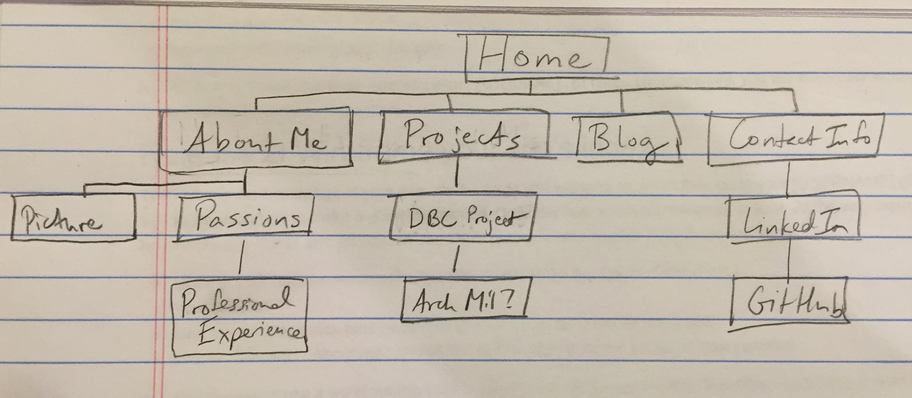

## 1. What are the 6 Phases of Web Design?
1) Information Gathering - the developer gets a solid understanding of the company's purpose (to provide information, promote a service, sell a product), goals (what they hope to accomplish), target audience (age, sex, interests), and content (what kind of information will be included).

2) Planning - the developer develops a site map, keeping the end-user in mind, considers what technologies should be implemented, and organizes how the main topics and subtopics will be navigated.

3) Design - the developer determines the look and feel of the site, making a prototype, a wireframe, for the client to view the work in progress.

4) Development - using HTML and CSS, the developer makes a homepage and shell for the interior pages, distributing information appropriately throughout the site. At this time is is also important to make other technical elements such as WordPress and forms functional.

5) Testing and Delivery - the developer makes sure all elements are functional, checks for compatibility issues, optimizes it for the most recent browser versions, and validates the code. At this time a developer may also provide search engine optimization. Then a File Transfer Protocol is used to upload web site files to your server.

6) Maintenance - the client and developer decide who will be responsible for maintaining the website.

## 2. What is your site's primary goal or purpose? What kind of content will your site feature?
My site will target potential employers so it should be easy to navigate to pertinent information such as my background, passions, professional experience, past projects I have worked on, my blog, and contact information.

## 3. What is your target audience's interests and how do you see your site addressing them?
Potential employers would likely want to get a sense of the work I've done and of who I am as a person to know if they want to pursue a partnership with me.

## 4. What is the primary "action" the user should take when coming to your site? Do you want them to search for information, contact you, or see your portfolio? It's ok to have several actions at once, or different actions for different kinds of visitors.
I will include 4 main routes in my navigation bar for a user to go to click on and immediately go where they need to go - About Me, Projects, Blog, and Contact Info.

## 5. What are the main things someone should know about design and user experience?
Web design needs to be grounded in usability, navigation, and accessibility, not just how the site looks. It is important to know the client's goals, target audience, purpose, and the content to include. Furthermore, the website must be designed with the end user in mind - ease of use, efficiency, perception of its usefulness and value, etc.

## 6. What is user experience design and why is it valuable?
User experience design takes into consideration all the ways an end user will engage with the website. If the site is not user-friendly, the client's goals will not be met as users will find a better site that offers as good of service or product.

## 7. Which parts of the challenge did you find tedious?
I found the reflection questions a little tedious because I don't think the content I have to distribute through my website is much of anything yet, but they are important questions to get in the habit of thinking through. I appreciated the required articles as they helped me see the big picture and sparked some ideas. The link to "Designing for performance" looks like a useful link I will come back to when my skills are more developed.