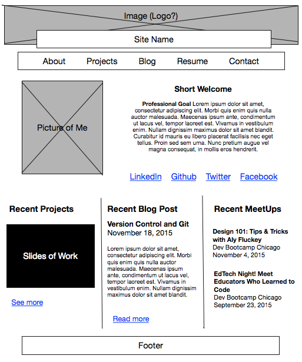
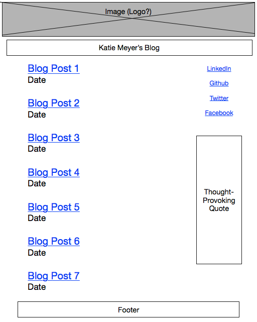

Wireframe of Main Site Index

Wireframe of Blog Index

# Reflection Questions

## What is a wireframe?
A wireframe is a mockup of what the site layout will look like. It is an image made up of where information will be placed on the page.

## What are the benefits of wireframing?
It gives you a chance to plan for how the information will be distributed across the page. It will save time when it is time to actually develop the site because there is a crystalized goal that has already been established. Wireframes are also used to communicate with clients.

## Did you enjoy wireframing your site?
Yeah! See the next question.

## Did you revise your wireframe or stick with your first idea?
At first I didn't think I would have any ideas and that I would do a layout similar to a website I like. But one of the articles recommended that clients not look to other websites they like, but rather think about the information they personally want to get across and custom make it from their preferences. As I worked it kept evolving, borrowing ideas here and there, but mainly letting my thoughts lead the way.

## What questions did you ask during this challenge? What resources did you find to help you answer them?
- What do layouts for blogs look like? (I don't read blogs enough to have a good sense) This image gave me a quick sense (I wanted to avoid heading down a rabbit hole): [blog layouts](http://madidus.different-themes.com/img/DiferrentBlogLayouts.png).

## Which parts of the challenge did you enjoy and which parts did you find tedious?
I enjoyed thinking through how I wanted to design the wireframe for my website. At first I didn't feel like I had much to work with, but as I worked I found I had some ideas and opinions for how I wanted it to look. I didn't find this challenge tedious.
