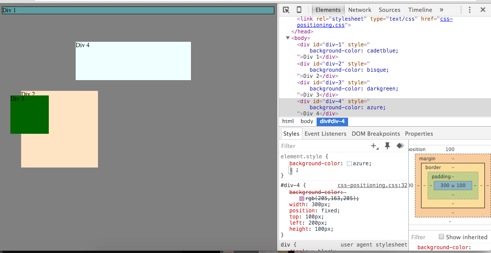
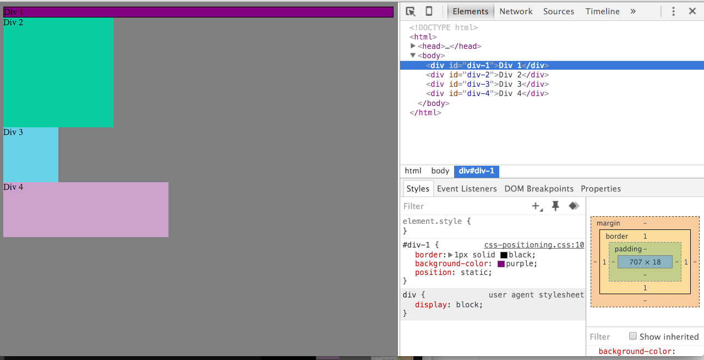
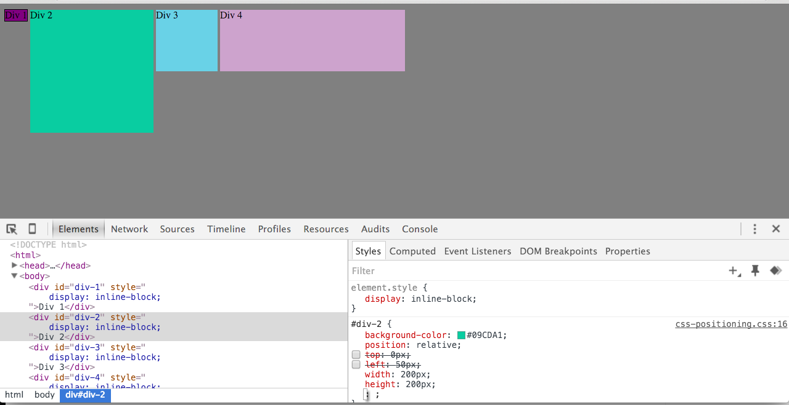
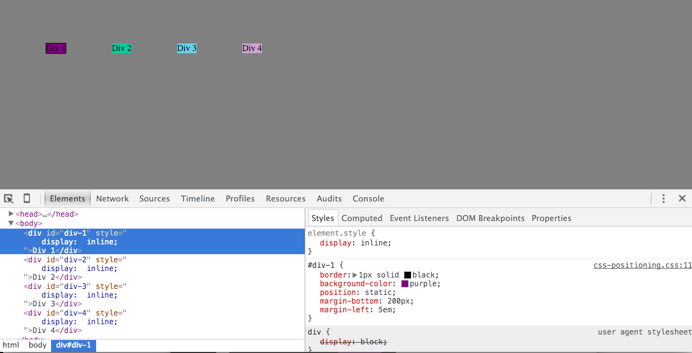
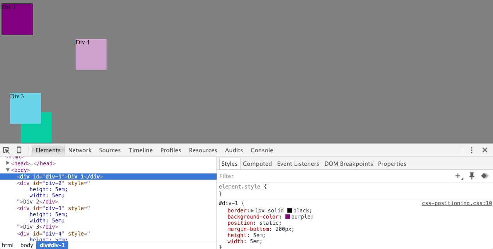
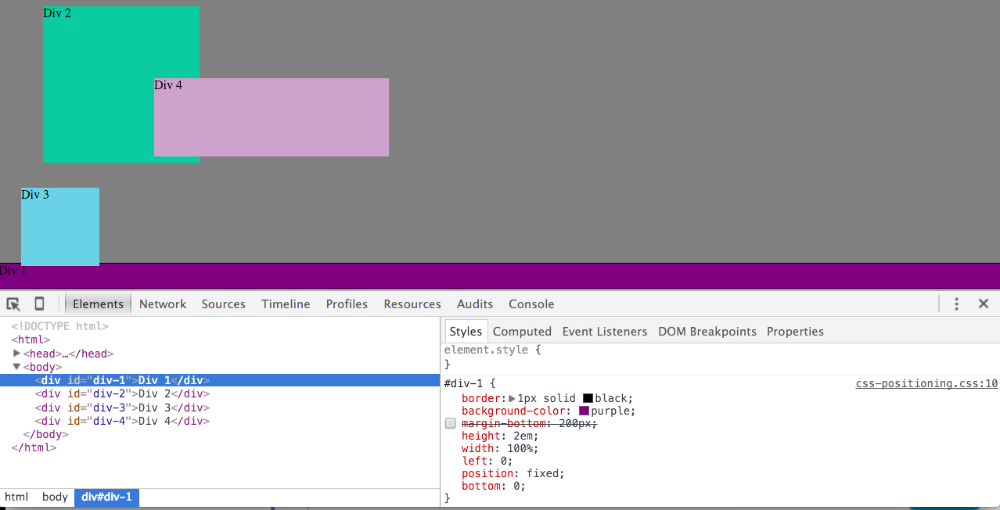
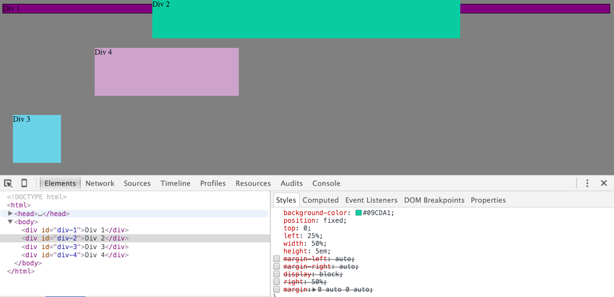
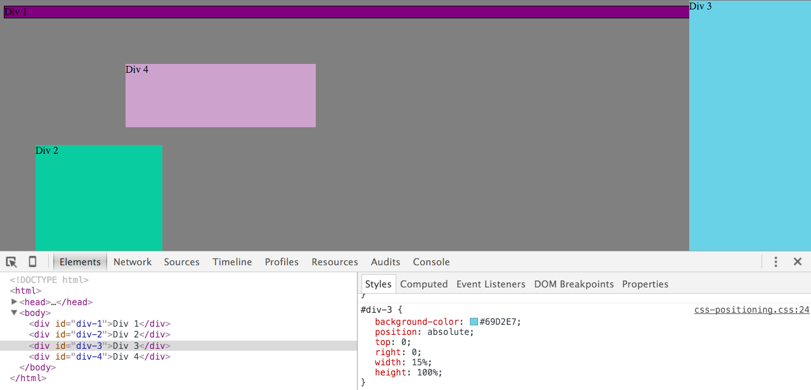
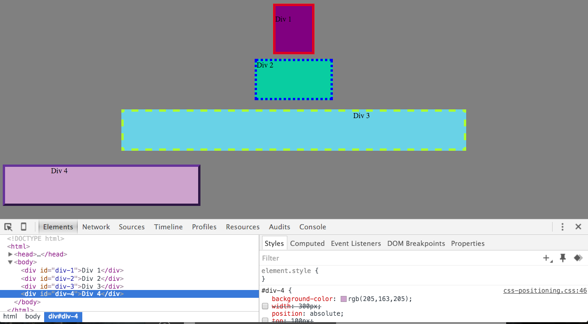

# 3.4 Chrome DevTools
##1 Change the Colors

##2 Column

##3 Row

##4 Make Equidistant

##5 Squares

##6 Footer

##7 Header

##8 Sidebar

##9 Get Creative

# Reflection for 3.4 Peer Challenge
## How can you use Chrome's DevTools inspector to help you format or position elements?
This was fascinating! It was helpful to play around with the positioning elements to see how the boxes responded differently. It was a great way to learn, frustrating, but helpful. I have watched a few videos on positioning to try to grasp the concept better and every video I have watched uses this method to explain it! One in particular was helpful as he changed the positioning of one word of text from a paragraph and showed what each of the four positions looked like.

## How can you resize elements on the DOM using CSS?
There are a few ways. You can change the width and height of an object. You can set the top, right, bottom, and left parameters. You can change the margin and padding dimensions. Even changing the positioning, for example from static to relative, can make a drastic difference in size. This question helps me realize why some of the challenges were so hard, because I didn't fully see all the factors that impact the size.

## What are the differences between absolute, fixed, static, and relative positioning? Which did you find easiest to use? Which was most difficult?
Oh man, this question. I've been spending a lot of my time this week trying to wrap my head around these concepts! I don't think I've got it yet, but I know more than when I started!

- static is the default position where an element will fill the width of the page and stack on top of each other, unless specified not to
- relative takes directional properties of top, right, bottom, and left to move the element to the specified position it is being assigned; it flows with the page, but with specified properties
- absolute will "absolutely be positioned within its nearest parent that is positioned"; this likely takes it out of the page flow and will be positioned to the page itself or its nearest parent that has a position (but is not position static); other elements will flow as if it is not there
- fixed is much like absolute in that it does not fall into the page flow but is positioned to the browser window (it will not respect any of its parents, however); it will stay exactly where you position it even as you scroll

## What are the differences between margin, border, and padding?
- margin - is the space around the outside of the border that can be used to prevent side-by-side elements from touching each other
- border - can be used to create a line around the element
- padding - is within the border of the element and helps create space between the border and the content so that it doesn't look too cramped, making it more readable

## What was your impression of this challenge overall? (love, hate, and why?)
I appreciated it, especially as my pair really enjoyed tinkering with the elements. By watching his fascination and playfulness, I learned that some of this just requires a playful spirit! Not fully understanding the positioning piece was really frustrating. But I will bookmark the page to come back to and experiment with as I get more comfortable with positioning!
