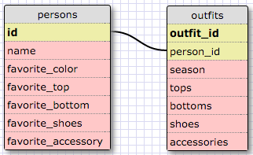

# Release 5: SELECTing data from a database

1. Select all data for all states.
`SELECT * FROM states;`

2. Select all data for all regions.
`SELECT * FROM regions;`

3. Select the state_name and population for all states.
`SELECT state_name, population FROM states;`

4. Select the state_name and population for all states ordered by population. The state with the highest population should be at the top.
`SELECT state_name, population FROM states ORDER BY population DESC;`

5. Select the state_name for the states in region
`SELECT state_name FROM states WHERE region_id = 7;`

6. Select the state_name and population_density for states with a population density over 50 ordered from least to most dense.
`SELECT state_name, population_density FROM states WHERE population_density > 50 ORDER BY population_density ASC;`

7. Select the state_name for states with a population between 1 million and 1.5 million people.
`SELECT state_name FROM states WHERE population BETWEEN 1000000 AND 1500000;`

8. Select the state_name and region_id for states ordered by region in ascending order.
`SELECT state_name, region_id FROM states ORDER BY region_id ASC;`

9. Select the region_name for the regions with "Central" in the name.
`SELECT region_name FROM regions WHERE region_name LIKE '%Central%';`

10. Select the region_name and the state_name for all states and regions in ascending order by region_id. Refer to the region by name. (This will involve joining the tables).
`SELECT regions.region_name, states.state_name FROM regions JOIN states ON regions.id = states.region_id ORDER BY states.region_id ASC;`

**My Schema**

**Reflection**
*What are databases for?*
Databases are collections of organized data that can be manipulated (create, add, edit, delete data), queried (retrieve information), aggregated (where calculations can be performed), and relate/connect data across multiple tables.

*What is a one-to-many relationship?*
Where one value from a table is related to many values of another table. They are linked with primary and foreign keys.

*What is a primary key? What is a foreign key? How can you determine which is which?*
A primary key is a unique identifier for each row or record in a given table. In this column, none of the values are NULL and each value is unique. A foreign key is a column that contains the primary key of another table in the database. It holds the value of the other (related) table's primary key. It does not need to be unique and it can have a value of NULL. The primary key and the foreign key are used to connect rows in different tables.

*How can you select information out of a SQL database? What are some general guidelines for that?*
- Use SELECT to identify the desired column and FROM to denote which table the column is in
- Always have semicolon at end of command
- * would select all data from a table
- WHERE can filter results based on conditions you specify (can use comparator operators)
- LIKE and BETWEEN can be used in a WHERE clause to narrow the results
- AND and OR can also be used with the WHERE filter
- ORDER BY allows you to sort results in ascending or descending order ASC/DESC
- LIMIT allows you to specify the maximum number of rows returned