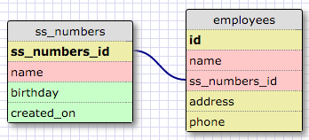
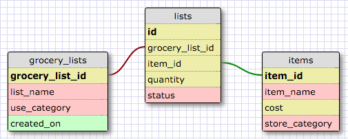

**One-to-One**

This is a one-to-one relationship because there cannot be duplicates of social security numbers and ever person only has one. It is also possible that a person does not have a social security number. (I know this may be debatable... )

**One-to-Many**

This is a one-to-many relationship because people can only have one birth mother, but birth mothers can have more than one child.

**Many-to-Many**

**Reflect**

*What is a one-to-one database?*

A database where two things on separate tables have a single relationship to one another. Having a single relationship means each has only one of the other or possibly none of the other.

*When would you use a one-to-one database? (Think generally, not in terms of the example you created).*

A one-to-one database could be useful if you want to keep information more private by linking the ID rather than the information. It is also useful if you want to make information passing more efficient by linking an id number rather than a text data.

*What is a many-to-many database?*

A many-to-many database relates information across tables where connected entities and attributes can have multiple of one another.

*When would you use a many-to-many database? (Think generally, not in terms of the example you created).*

Many-to-many databases have lots of practical applications. Most things have multiple attributes associated with them. Many-to-many databases help organize those relationships.

*What is confusing about database schemas? What makes sense?*

It is hard to imagine scenarios for one-to-one relationships. One-to-many and many-to-many relationships make sense to me, the tricky part will be in using SQL to join tables.